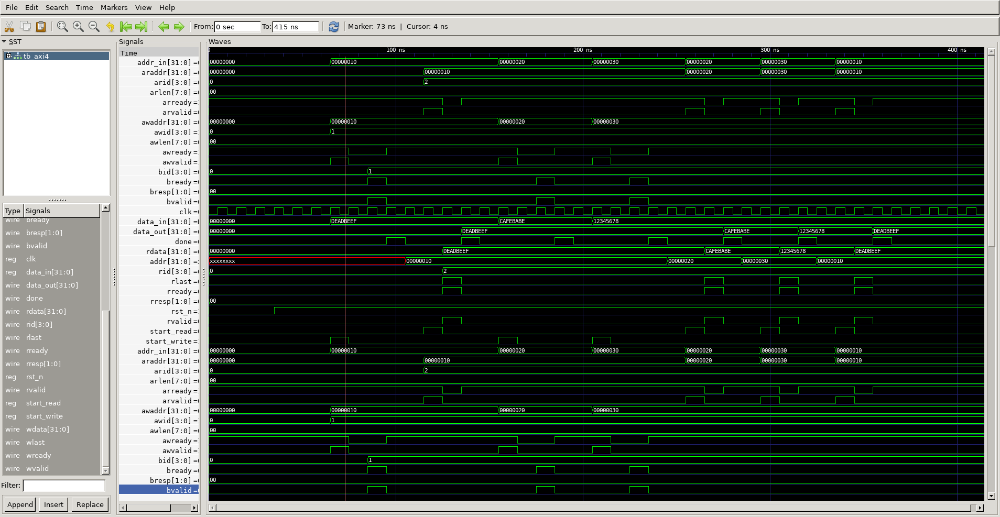

# AXI4 Master-Slave Interconnect

A parameterized AXI4 Master and Slave BFM implemented in Verilog,
verified with Icarus Verilog and GTKWave.

## Block Diagram

    ┌─────────────────────┐         ┌─────────────────────┐
    │     AXI4 Master     │──AW────▶│                     │
    │                     │──W─────▶│     AXI4 Slave      │
    │  FSM-based          │◀─B──────│   256-word SRAM     │
    │  Controller         │──AR────▶│                     │
    │                     │◀─R──────│                     │
    └─────────────────────┘         └─────────────────────┘

## Architecture

- AXI4 Master: FSM-based controller for write and read transactions
- AXI4 Slave: Memory-mapped slave with 256-word internal SRAM
- Full 5-channel handshake: AW / W / B / AR / R channels
- Parameterized DATA_WIDTH, ADDR_WIDTH, ID_WIDTH

## Protocol Compliance

- VALID/READY handshake on all 5 channels per AMBA AXI4 spec (IHI0022H)
- AWVALID held until AWREADY asserted
- WLAST asserted on final beat of write burst
- BREADY asserted by master before accepting write response
- No out-of-order transaction IDs (single outstanding transaction)

## Features

- Write address latching with separate write-response FSM
- Read burst counter with rlast generation
- Zero protocol violations verified via waveform analysis

## Waveform

## Results

    [WRITE] addr=0x00000010 data=0xDEADBEEF  OK
    [READ]  addr=0x00000010 data=0xDEADBEEF
    [WRITE] addr=0x00000020 data=0xCAFEBABE  OK
    [READ]  addr=0x00000020 data=0xCAFEBABE
    *** PASS: Readback correct! ***

## How to Run

    iverilog -o sim/axi4_sim rtl/axi4_master.v rtl/axi4_slave.v tb/tb_axi4.v
    vvp sim/axi4_sim
    gtkwave sim/axi4.vcd

## Repository Structure

    axi4_fabric/
    ├── rtl/
    │   ├── axi4_master.v
    │   └── axi4_slave.v
    ├── tb/
    │   └── tb_axi4.v
    ├── sim/
    │   └── axi4.vcd
    ├── Makefile
    └── README.md

## Tools

- Icarus Verilog 10.3
- GTKWave 3.3.103
- Ubuntu 20.04

## Skills Demonstrated

- AMBA AXI4 protocol implementation
- FSM-based handshake design
- Parameterized RTL coding
- Waveform-based verification
